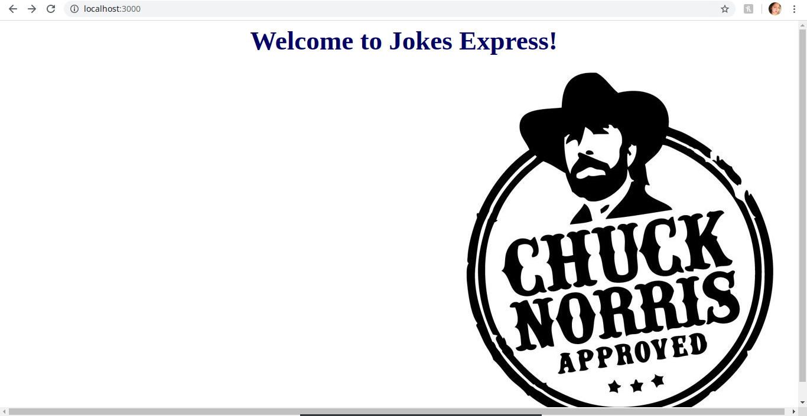
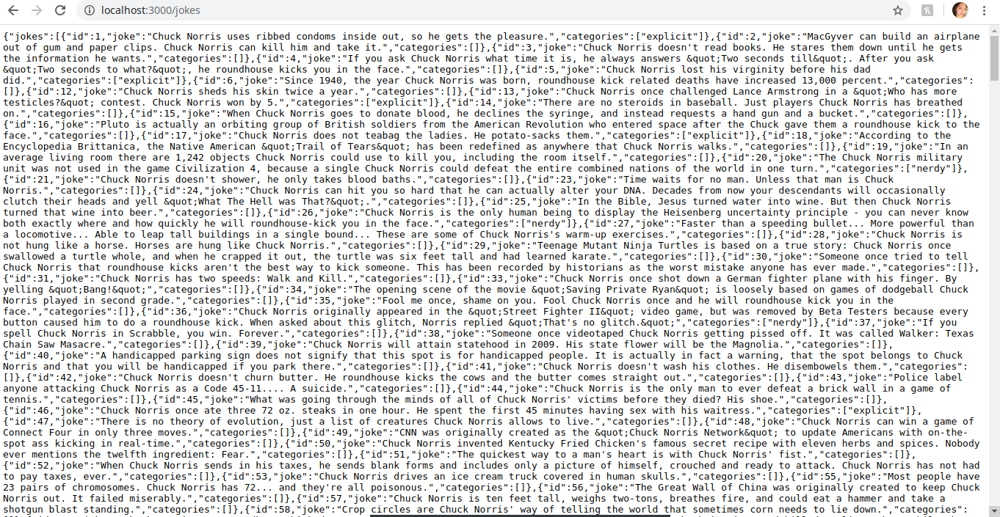
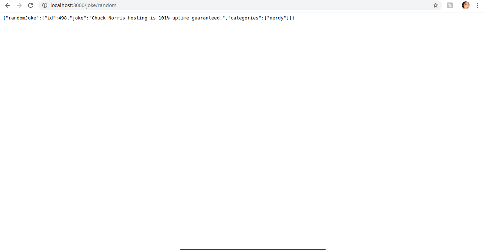
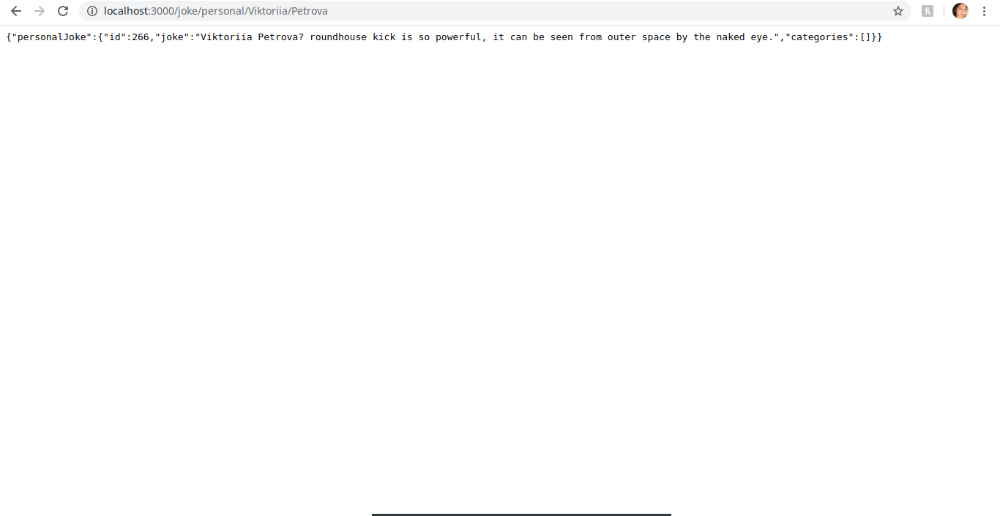

# Jokes Express

## by Chuck Norris

In this project I was practising how to make an endpoint using

- express
- request
- axios
- nock

Also I was introduced severals ways of dealing with promises as

- callback
- promise
- async&await

# Description

## Setup

Clone my repo and type 'npm start' in your terminal. It should notify you "Now serving your Express app at http://localhost:3000".

## Welcoming page

The website contains jokes by Chuck Norris. The beginning of the journey starts with http://localhost:3000, where you can find the welcoming page.

## List of the jokes

To see the full list of the jokes proceed the following URL http://localhost:3000/jokes.

## A random joke

In order to get a random joke - http://localhost:3000/joke/random.

## A personal joke

Also you can get a personalised joke about you or your friend. Just replace the name and surname with required in the following URL /joke/personal/name/surname.

## Contributing

Pull requests are welcome. For major changes, please open an issue first to discuss what you would like to change.

## Author

Created by Viktoriia Petrova as part of <a href="https://www.manchestercodes.com" target="_blank">Manchester Codes</a> learning process.
